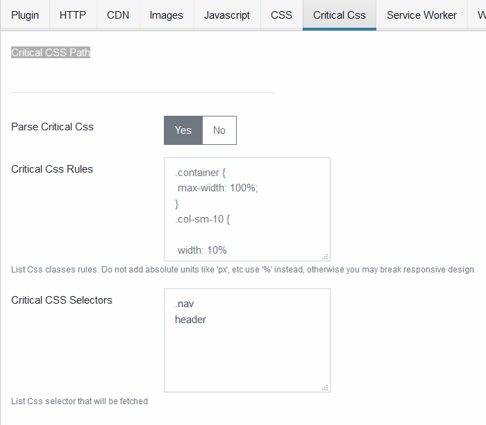

# Critical CSS

Configure Critical CSS path.



## Parse Critical CSS

Enable or disable Critical CSS processing

## Critical Css Rules

Add CSS that will be included with the extracted critical css. In general the classes you add there should not contain absolute measures but percentage. Otherwise responsive design might be broken.
Example

```css
.container {
  max-width: 100%;
}
.col-sm-10 {
  width: 10%;
}
```

## Critical CSS Selectors

List of css selectors that will be extracted from the page in order to build the critical css.
Example

```css
.nav
header
```
