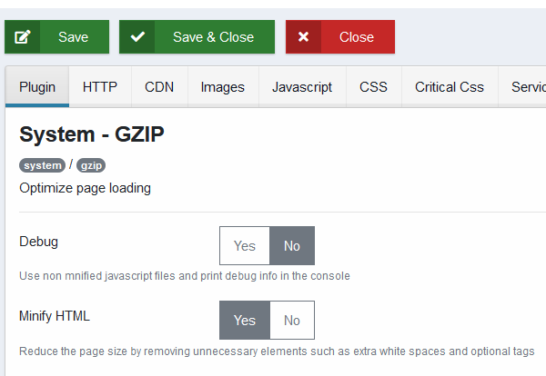
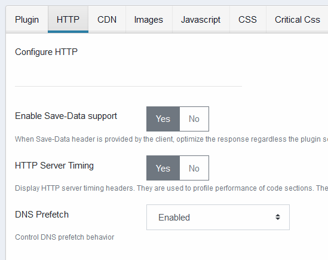
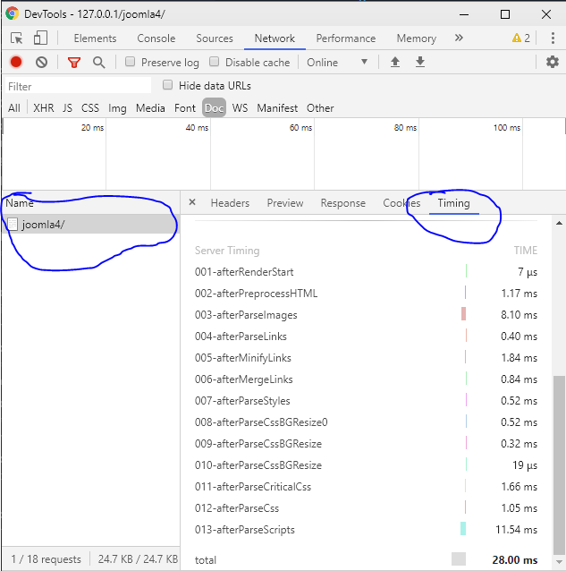
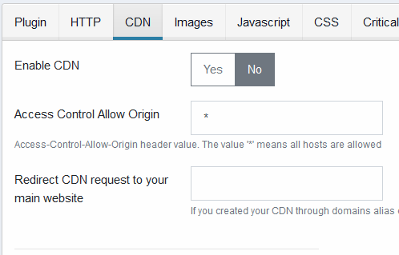
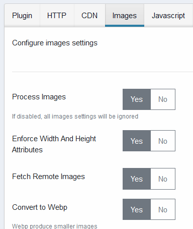

# Joomla GZIP Plugin Documentation

_V2.6.0_

- [Joomla GZIP Plugin Documentation](#joomla-gzip-plugin-documentation)
  - [Installing](#installing)
  - [Manage Settings](#manage-settings)
    - [General Settings](#general-settings)
      - [Debug](#debug)
      - [Minify HTML](#minify-html)
    - [HTTP Settings](#http-settings)
      - [Enable Save-Data support](#enable-save-data-support)
      - [HTTP Server Timing](#http-server-timing)
      - [DNS Prefetch](#dns-prefetch)
      - [HTTP Push](#http-push)
      - [Cache File](#cache-file)
      - [Hashing Method](#hashing-method)
      - [Cache Prefix](#cache-prefix)
      - [Max Age](#max-age)
      - [CORS Headers](#cors-headers)
      - [Custom Mimetypes](#custom-mimetypes)
      - [Custom Attributes](#custom-attributes)
    - [CDN](#cdn)
      - [Enable CDN](#enable-cdn)
      - [Access Control Allow Origin](#access-control-allow-origin)
      - [Redirect CDN Request](#redirect-cdn-request)
      - [CDN1, CDN2, CDN3](#cdn1-cdn2-cdn3)
      - [Enable static domain for custom resources type](#enable-static-domain-for-custom-resources-type)
      - [Use Static Domain](#use-static-domain)
    - [Images](#images)
      - [Process Images](#process-images)
      - [Enforce Width and Height Attributes](#enforce-width-and-height-attributes)
      - [Fetch Remote Images](#fetch-remote-images)
      - [Convert Images to Webp](#convert-images-to-webp)
      - [Ignored Images](#ignored-images)
      - [Crop Method](#crop-method)
      - [Image Placeholder](#image-placeholder)
      - [Responsive Images](#responsive-images)
      - [Responsive Image Breakpoints](#responsive-image-breakpoints)
      - [Responsive CSS background Images](#responsive-css-background-images)
      - [Responsive CSS Image Breakpoints](#responsive-css-image-breakpoints)

    This document explains how to configure the Joomla GZip plugin.

What is the plugin doing?

This extension provides:

- when the client sends [Save-Data header](https://developers.google.com/web/fundamentals/performance/optimizing-content-efficiency/save-data/), optimizations are enforced.
- html, images, javascript and css optimizations (and more) that greatly improve page loading time
- service worker features like transforming your website into a progressive web application, configure an offline page, offline first application, push notifications, background sync, web share target level 2, network strategy and more ...
- improve security by providing configurable HTTP secure headers
- improve security by implementing Content Security Policy level 3 headers
- improve security by adding Sub Resource Integrity tokens to javascript and css files
- profile the plugin performance (or your server performance) by using the HTTP server timing headers

there are loads of settings provided to help you fine tune your website.

## Installing

this plugin has been developed for Joomla version 3 and 4. It requires rewrite rules to be enabled in order to work properly

## Manage Settings

### General Settings

Configure general settings


#### Debug

If yes, load plugin's unminified css and javascript files, otherwise load minfied versions.

#### Minify HTML

Enable or disable HTML minification.

### HTTP Settings



#### Enable Save-Data support

If yes, when the client sends Save-Data headers, optimizations are enforced regardless which settings you have configured.

#### HTTP Server Timing

Send HTTP Server Timing headers. They can be viewed in the google chrome network panel. Click on the network panel -> Click on your web page -> Click on the timing tab on the right. It should be turned off on production.



#### DNS Prefetch

Enable or disable DNS prefetch

```
- Ignore: let the browser decide
- Enabled: tell the browser to enable DNS prefetch
- Disabled: tell the browser to turn off DNS prefetch
```

#### HTTP Push

Choose which resource type will be pushed to the browser using HTTP push. Your web server need to use HTTP/2 for this feature to work properly.

#### Cache File

If Yes send file with http caching headers. This helps loading the page faster on the next visit because the file will be loaded from the browser cache instead of the network. Whenever a file is modified a new URL is generated so that the user will not see outdated content.

#### Hashing Method

Algorithn chosen when generating cached URL.

```
- Time: use file last modified time
- Etag: use file content instead of last modified time.
```

#### Cache Prefix

Cached URLs prefix.

#### Max Age

Specify how long files are cached by the browser.

#### CORS Headers

If yes send CORS headers when cached files are requested.

#### Custom Mimetypes

Extend the type of files that support HTTP caching. By default the plugin will cache images, javascript, css, fonts, xml. If you want to add pdf and psd files you will add for example

```
  pdf application/octetstream
  psd application/octetstream
```

#### Custom Attributes

Extend the list of attributes scanned in order to get urls of resources to cache. If you use lazylaoding, you might want to use custom attributes in order to store full size image. You can specify these here like that

```
  data-href
  data-src
  data-srcset
```

### CDN

Configure CDN settings.

This feature allow you to serve files from a different cookieless domain on your server. You create a different domain that point to the same root as your web site.



#### Enable CDN

Enable or disable the CDN feature.

#### Access Control Allow Origin

Value send in the *Access Control Allow Origin* HTTP header. The default value is *\**

#### Redirect CDN Request

If a user access your cdn host name directly, he will be redirected to the url you specify here.

#### CDN1, CDN2, CDN3

CDN host names from which files will be loaded.

#### Enable static domain for custom resources type

You can specify which custom resources will be served from your custom CDN. you may for example serve pdf from you cdn by adding

```
  pdf application/octetstream
```

#### Use Static Domain

Specify Which resource are served from CDN domains.

### Images

Configure images settings.



#### Process Images

Turn images feature ON or OFF

#### Enforce Width and Height Attributes

Whether or not enforce width and height attributes for all HTML \ tags

#### Fetch Remote Images

Fetch images hosted on remote hosts and store them locally.

#### Convert Images to Webp

Convert images to Webp. Webp produce smaller images than jpg or png.

#### Ignored Images

Images that match any pattern you specify here will be ignored. Example

```
  images/optimized/
  images/thumbnails/
```

#### Crop Method

Algorithm use when resizing images. Values are

```
- Default
- Center
- Entropy
- Face Detection
```

#### Image Placeholder

Whether or not use an image placeholder. **Choosing a placeholder algorithm will enable images lazyloading**. Values are

```
  - None
  - SVG: use an svg image as the placeholder
  - Low Quality Image: Generate a low quality image from the picture.
  ```

#### Responsive Images

Automatically generate responsive images

#### Responsive Image Breakpoints

Selected breakpoints from which responsive images will be generated. The algorithm used is whatever you have specified in the *CROP Method* parameter

#### Responsive CSS background Images

Automatically generate css background images

#### Responsive CSS Image Breakpoints

Selected breakpoints from which css background responsive images will be generated. The algorithm used is whatever you have specified in the *CROP Method* parameter


