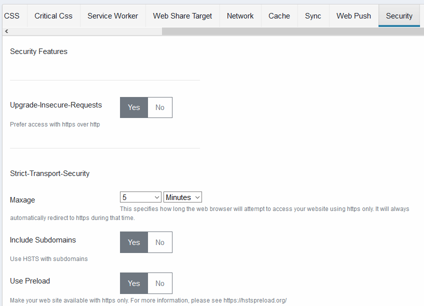

# Security

Configure security features



Configure security settings such as XSS protection or HSTS

## Upgrade-Insecure-Requests

Redirect http to https

## Maxage

Strict-Transport-Security maxage

## Include Subdomains

Include subdomains in the HSTS header

## Use HSTS Preload

Make your web site available with https only. For more information, please see [https://hstspreload.org/](https://hstspreload.org/)

## X-Content-Type-Options

Configure X-Content-Type-Options header. Values are

- None: do not send the header
- No Sniff: send nosniff

## X-Frames-Options

Configure the X-Frames-Options header. Values are

- None: do not override the header
- Deny: set the value to DENY
- Same Origin: Set the value to SAME_ORIGIN
- Allow From an Origin: allow frame inclusion from the url provided in _Allow from URI_ setting

## Allow from URI

Allow your website to be embedded from this this URI. X-Frame-Options value must be set to _'Allow from an origin'_ for this to work

## XSS-Protection

Configure XSS-Protection header. Values are

- None: do not override the header
- Disable: do not send the header
- Filter: enable XSS-Protection filtering. The browser will sanitize the page
- Block: enable XSS-Protection filtering. The browser will block page rendering if anattack is detected
- Block and Report: enable XSS-Protection filtering. The browser will sanitize the page and report the violation to the URI configured with _XSS Report URL_ setting

## Subresource Integrity Checksum (SRI)

Prevent file tampering by adding a signature to the HTML tag. This feature is used for css and javascript only. Values are

- None: do not set the SRI
- SHA256: compute SRI using SHA256
- SHA384: compute SRI using SHA384
- SHA512: compute SRI using SHA512

## Meta Generator

Change the value of the meta generator header

## Admin Area Secret

Configure the secret token used to access the Joomla administrator. For example if you configure _secret123_ as your secret token, you will need to access your joomla administrator by adding _?secret123_ at the end of the url

```http
https://www.mywebsite.com/administrator/?secret123
```
