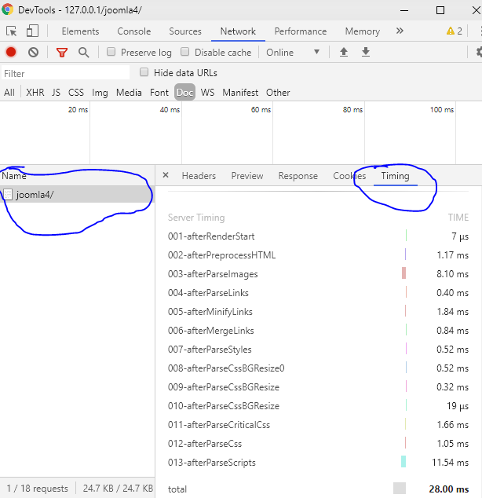
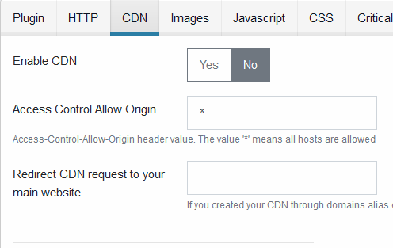
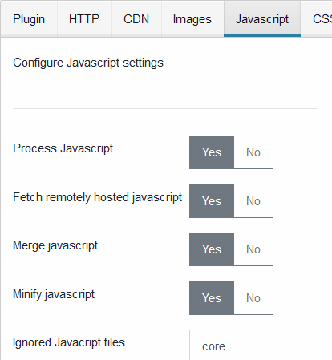
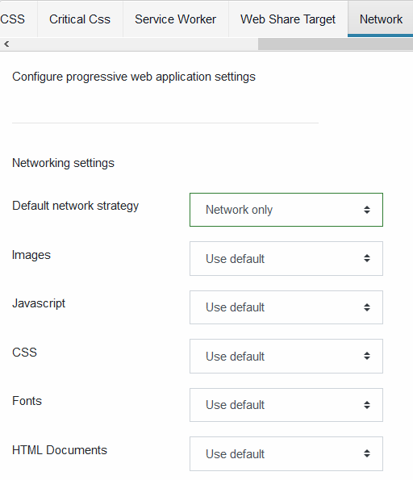
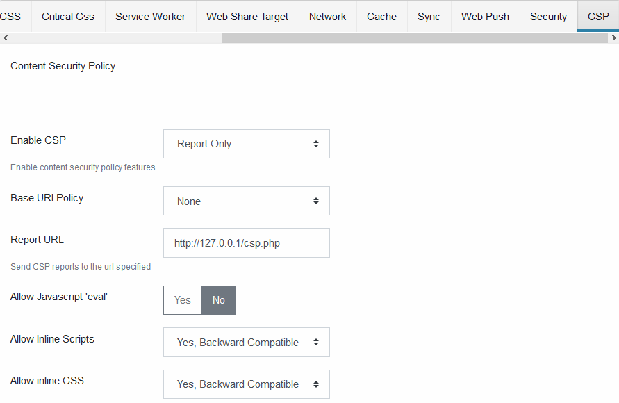

This document explains how to configure the Joomla GZip plugin. it provides:

- optimizations are enforced when the client sends [Save-Data HTTP header](https://developers.google.com/web/fundamentals/performance/optimizing-content-efficiency/save-data/)
- html, images, javascript and css optimizations (and more) that greatly improve page loading time
- service worker features like transforming your website into a progressive web application, configure an offline page, offline first application, push notifications, background sync, web share target level 2, network strategy and more ...
- improve security by providing configurable HTTP secure headers
- improve security by implementing Content Security Policy level 3 headers
- improve security by adding Sub Resource Integrity tokens to javascript and css files
- profile the plugin performance (or your server performance) by using the HTTP server timing headers

There are loads of settings provided to help you fine tune your website.

## Installing

This plugin has been developed for Joomla version 3 and 4. It requires rewrite rules to be enabled in order to work properly

## Manage Settings

### General Settings

Configure general settings


#### Debug

If yes, load plugin's unminified css and javascript files, otherwise load minified versions.

#### Minify HTML

Enable or disable HTML minification.

### HTTP Settings

Configure HTTP settings


#### Enable Save-Data support

If yes, when the client sends Save-Data headers, optimizations are enforced regardless which settings you have configured. Enforced optimizations are

- HTML minification
- Image processing: conversion, size enforcement, resize css images
- CSS: Async loading, css minification, fetching remote css files, critical css settings
- Javascript: merge, minify, fetch remote javascript files

#### HTTP Server Timing

Send HTTP Server Timing headers. They can be viewed in the google chrome network panel. Click on the network panel -> Click on your web page -> Click on the timing tab on the right. It should be turned off on production.
ps: this helped me spot a [regression in the image processing](https://github.com/tbela99/gzip/issues/38) that has since been fixed



#### DNS Prefetch

Enable or disable DNS prefetch

- Ignore: let the browser decide
- Enabled: tell the browser to enable DNS prefetch
- Disabled: tell the browser to turn off DNS prefetch

#### HTTP Push

Choose which resource type will be pushed to the browser using HTTP push. Your web server need to use HTTP/2 for this feature to work properly.

#### Cache File

If Yes send file with http caching headers. This helps loading the page faster on the next visit because the file will be loaded from the browser cache instead of the network. Whenever a file is modified a new URL is generated so that the user will not see outdated content.

#### Hashing Method

Algorithm chosen when generating cached URL.

- Time: use file last modified time
- Etag: use file content instead of last modified time.

#### Cache Prefix

Cached URLs prefix.

#### Max Age

Control HTTP caching. If the value is large enough, the files are stored in the browser cache.

#### CORS Headers

If yes send CORS headers when cached files are requested.

#### Custom Mimetypes

Extend the type of files that support HTTP caching. By default the plugin will cache images, javascript, css, fonts, xml. If you want to add pdf and psd files for example you will add this

```markdown
  pdf application/octetstream
  psd application/octetstream
```

#### Custom Attributes

Extend the list of attributes scanned in order to get urls of resources to cache. If you use lazylaoding, you might want to use custom attributes in order to store full size image. You can specify these here like that

```markdown
  data-href
  data-src
  data-srcset
```

### CDN

Configure CDN settings.

This feature allow you to serve files from a different cookieless domain on your server. You create a different domain that point to the same root as your web site.



#### Enable CDN

Enable or disable the CDN feature.

#### Access Control Allow Origin

Value sent in the *Access Control Allow Origin* HTTP header. The default value is *\**

#### Redirect CDN Request

If a user access your cdn host name directly, he will be redirected to the url you specify here.

#### CDN1, CDN2, CDN3

CDN host names from which files will be loaded.

#### Enable CDN Domain for Custom Resources Type

You can specify which custom resources will be served from your custom CDN. you may for example serve pdf from you cdn by adding this for example

```markdown
  pdf application/octetstream
```

#### Use CDN Domain

Specify Which resource are served from CDN domains.

### Images

Configure images settings.


#### Process Images

Turn images feature ON or OFF. Alt attribute is also enforced on HTML images when this setting is enabled

#### Enforce Width and Height Attributes

Whether or not enforce width and height attributes for all HTML \ tags

#### Fetch Remote Images

Fetch images hosted on remote hosts and store them locally.

#### Convert Images to Webp

Convert images to Webp. Webp produce smaller images than jpg or png.

#### Ignored Images

Images that match any pattern you specify here will be ignored. Example

```markdown
  images/optimized/
  images/thumbnails/
```

#### Crop Method

Algorithm used when resizing images. Values are

- Default
- Center
- Entropy
- Face Detection

#### Image Placeholder

Whether or not use an image placeholder. **Choosing a placeholder algorithm will enable images lazyloading**. Values are

- None: disable lazyloading
- SVG: use an svg image as the placeholder
- Low Quality Image: generate a low quality image from the picture.

#### Responsive Images

Enable or disable automatic generation of responsive images. Responsive images are generated for all the breakpoints you select

#### Responsive Image Breakpoints

Selected breakpoints from which responsive images will be generated. The algorithm used is whatever you have specified in the *CROP Method* parameter

#### Responsive CSS background Images

Enable or disable automatic generation of css background images. Responsive css are generated for the css breakpoints you select

#### Responsive CSS Image Breakpoints

Selected breakpoints from which css background responsive images will be generated. The algorithm used is whatever you have specified in the *CROP Method* parameter

### Javascript

Configure Javascript settings.



#### Process Javascript

Enable or disable javascript processing. Javascript will be moved at the bottom of the page

#### Fetch Remotely Hosted Javascript

Fetch javascript files hosted on remote hosts like cdn and store them locally. The local copy will be used instead.

#### Minify Javascript

Minify inline javascript and javascript files

#### Merge Javascript

Enable or disable merging javascript files together

#### Ignore Javascript

If you want to exclude a javascript file from processing, add a pattern to match that file here. For example you might have an obligation to run a file from a remote cdn. Adding it here will reven fetching that file locally

#### Remove Javascript Files

Remove a javascript file from the page. Any file that matches the pattern provided is removed from the page.

### CSS

Configure CSS settings.


#### Process CSS

Enable or disable CSS processing

#### Font Display

Set font-display css property. It requires Parse Critical CSS settings must be enabled

#### Fetch Remotely Hosted CSS

Fetch CSS files hosted on remote servers.

#### Minify CSS

Enable or disable merging css files together

#### Load CSS Async

Asyncronously load css so that page rendering is not blocked while css files are loading. CSS files will be moved at the bottom of the page. We should configure critical css in order to avoid FOUC

#### Merge CSS

Enable or disable merging css files together

#### Ignored Javacript files

If you want to exclude a css file from processing add a pattern that match that file here.

#### Removed Javacript Files

Remove a css file from the page. Any file that matches the pattern provided is removed from the page

### Critical CSS

Configure Critical CSS path.


#### Parse Critical CSS

Enable or disable Critical CSS processing

#### Critical Css Rules

Add CSS that will be included with the extracted critical css. In general the classes you add there should not contain absolute measures but percentage. Otherwise responsive design might be broken.
Example

```css
.container {
 max-width: 100%;
}
.col-sm-10 {

 width: 10%
}
```

#### Critical CSS Selectors

List of css selectors that will be extracted from the page in order to build the critical css.
Example

```css
.nav
header
```

### Service Worker

Configure progressive web application settings


#### Enable Service Worker

Configure the service worker. Values are

- Enabled: Activate the service worker
- Disabled:This will not deactivate the service worker if it is already running in the browser. The service worker initialization script will not be included in the pages.
- Force Uninstall: Actively remove the service worker from the browser

#### Debug Service Worker

Enable or disable debug mode in the service worker.

- Yes: Use unminified files from the service worker. Also log messages in the browser console
- No: Use minified files from the service worker. Only error messages are logged into the browser console

#### Enable Offline Page

Enable or disable offline page settings. Offline page is shown whenever the browser cannot load the page.

#### Offline Method

Configure which requests are intercepted by the service worker. The service worker will intercept the requests that use the method selected here

#### Prefered Offline Page

Configure which method to use in order to display the offline page. You have two ways of specifying the offline page

- URL: use 'Offline Page URL' setting
- HTML: use 'Offline HTML Page' setting

#### Offline page URL

Specify the URL from which the offline page will be loaded

#### Offline HTML Page

Provide HTML content of the offline page

These settings control the service worker manifest file

#### Build Manifest File

Enable or disable the manifest file. The manifest file is used to configure the progressive app settings. For more information about the manifest settings go to this [mdn page](https://developer.mozilla.org/en-US/docs/Web/Manifest)

#### App Short Name

Provide the app short name

#### App Name

Provide the app name

#### App Description

Provide app description

#### Start URL

Provide the URL of the start page of your progressive web application once it is installed

#### Background Color

Provide the background color

#### Theme Color

Provide the app theme color

#### Display Mode

Configure the app display mode

#### Cache URLs

Provide a list of urls available in offline mode.

#### Do Not Cache URLs

Provide a list of urls that will never be cached by the service worker

#### Apps Icons Directory

Select the directory that contains your app icons. The directory must be located under the /images folder

#### Prefer Native Apps

Indicate whether native apps should be preferred over this app

#### Android App Store Url

Android app associated with this app

#### IOS App Store Url

IOS app associated with this app

### Web Share Target

Configure your app to be a target for app data sharing.
This plugin implements Web Share Target Level 2


#### Enable Web Share Target

Enable or disable web share target feature

#### Action

The url where data shared with your app are sent. It can be a relative URL

#### Data Transfer Method

The method used to send data to your action url

#### Encoding Type

The encoding used by the action request. If you enable file transfer then the encoding type is set to multipart/formdata

These fields configure the payload sent to your action url

#### Use title attribute

Enable or disable the title attribute

#### Use text attribute

Enable or disable the text attribute

#### Use url attribute

Enable or disable the url attribute

#### Enable file sharing

Enable file sharing support allow your app to receive pictures shared by the users from their mobile phone or tablet

#### Title

Rename the title field to a name suitable to your application

#### Text

Rename the text field to a name suitable to your application

#### Url

Rename the url field to a name suitable to your application

#### File Type Metadata

A JSON metadata defining which files are accepted by your application. This example show an example of configuration that accepts both csv and jpeg files

```json
[
  {'name': 'records', 'accept': ['text/csv', '.csv']},
  {'name': 'image', 'accept': 'image/jpg'}
]
```

### Network Settings

Configure the service worker network strategies. You can customize different network strategies for different resource types



Network strategies define how the service worker should handle network requests. Implemented strategies are

- Use Default: Use the value configured as **Default Network Startegy**
- None: do not intercept network requests
- Network and Cache Fallback: attempt to load resource from the network. It the request fails attempt to load it from the cache
- Cache and Network Fallback: if the resource does not exist in the cache, load it from the network and put it in the cache
- Cache and Network Update: load the resource from the browser cache, fetch and cache the resource in the background
- Cache Only: load the resource from the cache. No network request will be attempted

#### Default Network Strategy

Define the default network strategy

#### Images

Defines the network strategy used for images

#### Javacript

Defines the network strategy used for javascript files

#### CSS

Defines the network strategy used for css files

#### Fonts

Defines the network strategy used for fonts

#### HTML Documents

Defines the network strategy used for html documents

### Cache

Configure the service worker cache settings


#### Manage Cache Expiry

Enable or disable cache management

#### Max File Numbers

The maximum number of files allowed in the cache. *0* means no limit

#### Max File Size

The maximum size of a cacheable file

#### Default Cache Retention

The maximum caching duration for a file

#### Image

Cache setting for images

#### Javascript

Cache setting for javascript

#### CSS

Cache setting for CSS file

#### Fonts

Cache setting for fonts

#### HTML Documents

Cache setting for HTML documents

### Background Sync

Configure the service worker cache settings


#### Background Sync

Configure background sync feature

- Disabled: disable background sync
- Enabled: enable background sync
- Custom: enable background sync only for requests that match the provided pattern

#### Sync Methods

Sync requets that match the selected methods

- GET: sync GET requests
- POST: sync POST requests

#### URL Patterns

If *Background Sync* is set to *Custom* then sync the requests that match the provided settings

### Web Push

Configure web push settings using One Signal SDK


#### Enable

Enable or disable web push feature

#### App ID

One signal app ID

#### Api Key

One Signal api key

#### Test user

One signal test user ID

### Security

Configure security features


Configure security settings such as XSS protection or HSTS

#### Upgrade-Insecure-Requests

Redirect http to https

#### Maxage

Strict-Transport-Security maxage

#### Include Subdomains

Include subdomains in the HSTS header

#### Use HSTS Preload

Make your web site available with https only. For more information, please see [https://hstspreload.org/](https://hstspreload.org/)

#### X-Content-Type-Options

Configure X-Content-Type-Options header. Values are

- None: do not send the header
- No Sniff: send nosniff

#### X-Frames-Options

Configure the X-Frames-Options header. Values are

- None: do not override the header
- Deny: set the value to DENY
- Same Origin: Set the value to SAME_ORIGIN
- Allow From an Origin: allow frame inclusion from the url provided in *Allow from URI* setting

#### Allow from URI

Allow your website to be embedded from this this URI. X-Frame-Options value must be set to *'Allow from an origin'* for this to work

#### XSS-Protection

Configure XSS-Protection header. Values are

- None: do not override the header
- Disable: do not send the header
- Filter: enable XSS-Protection filtering. The browser will sanitize the page
- Block: enable XSS-Protection filtering. The browser will block page rendering if anattack is detected
- Block and Report: enable XSS-Protection filtering. The browser will sanitize the page and report the violation to the URI configured with *XSS Report URL* setting

#### Subresource Integrity Checksum (SRI)

Prevent file tampering by adding a signature to the HTML tag. This feature is used for css and javascript only. Values are

- None: do not set the SRI
- SHA256: compute SRI using SHA256
- SHA384: compute SRI using SHA384
- SHA512: compute SRI using SHA512

#### Meta Generator

Change the value of the meta generator header

#### Admin Area Secret

Configure the secret token used to access the Joomla administrator. For example if you configure *secret123* as your secret token, you will need to access your joomla administrator by adding *?secret123* at the end of the url

```http
https://www.mywebsite.com/administrator/?secret123
```

### Content Security Policy (CSP)

Configure Content Security Policy Level 3 features



#### Enable CSP

Configure CSP policies. Values are

- Disabled: disable CSP feature
- Report Only: CSP settings are not enforced but any violation is sent to the url configured with *Report URL* setting
- Enforce: apply the CSP settings

#### Report URL

CSP violation reports are sent to this url

#### Base URI Policy

Restricts the urls which can be used in a document's \<base\> element. Values are

- Ignore: do not set tbe value
- 'Self': set the value to 'Self'
- None: set the value to *'none'*

#### Allow Javascript 'eval'

Enable or disable javascript *'eval'* function

#### Allow Inline Scripts

Control inline scripts execution. Values are

- None: block all inline scripts
- Yes: this will allow any script with the *'nonce'* attribute, every other scripts will be blocked
- Yes, Backward Compatible: compatibility mode. this will enable all the scripts

#### Allow inline CSS

Control inline style. Values are

- None: block all inline styles
- Yes: this will allow any style with the *'nonce'* attribute, every other styles will be blocked
- Yes, Backward Compatible: compatibility mode. this will enable all the styles

#### Default Directive

Configure *default-src* directive. Values are

- Ignore: ignore the directive
- Block: block everything by default
- Custom: use whatever is provided in *Custom Settings*

#### Custom Settings

Configure additional settings for *default-src*

#### Scripts

Configure *script-src* directive. Values are

- Ignore: ignore the directive
- Dynamic: parse the page and add links to the whitelist
- Block: block scripts
- Custom: use whatever is provided in *Custom Script Settings*
- Mixed: append the value in *Custom Script Settings* to this setting

#### Custom Script Settings

Configure additional settings for *script-src*

#### Styles

Configure *style-src* directive. Values are

- Ignore: ignore the directive
- Block: block styles by default
- Dynamic: parse the page and add links to the whitelist
- Custom: use whatever is provided in *Custom Styles Settings*
- Mixed: append the value in *Custom Styles Settings* to this setting

#### Custom Styles Settings

Configure additional settings for *style-src*

#### Font Directive

Configure *font-src* directive. Values are

- Ignore: ignore the directive
- Block: block fonts by default
- Dynamic: parse the page and add links to the whitelist
- Custom: use whatever is provided in *Custom Font Settings*
- Mixed: append the value in *Custom Styles Settings* to this setting

#### Custom Font Settings

Configure additional settings for *font-src*

#### Image Directive

Configure *img-src* directive. Values are

- Ignore: ignore the directive
- Block: block images by default
- Dynamic: parse the page and add links to the whitelist
- Custom: use whatever is provided in *Custom Font Settings*
- Mixed: append the value in *Image Custom Settings* to this setting

#### Custom Image Settings

Configure additional settings for *worker-src*

#### Worker Directive

Configure *worker-src* directive. Values are

- Ignore: ignore the directive
- Block: block workers by default
- Custom: use whatever is provided in *Custom Worker Settings*

#### Custom Worker Settings

Configure additional settings for *worker-src*

#### Manifest Directive

Configure *manifest-src* directive. Values are

- Ignore: ignore the directive
- Block: block manifest files by default
- Custom: use whatever is provided in *Custom Manifest Settings*

#### Custom Manifest Settings

Configure additional settings for *manifest-src*

#### Child Directive

Configure *child-src* directive. Values are

- Ignore: ignore the directive
- Block: block everything by default
- Custom: use whatever is provided in *Custom Settings*

#### Custom Child Settings

Configure additional settings for *child-src*

#### Frame Directive

Configure *frame-src* directive. Values are

- Ignore: ignore the directive
- Block: block frames and iframes by default
- Dynamic: parse the page and add links to the whitelist
- Custom: use whatever is provided in *Custom Font Settings*
- Mixed: append the value in *Custom Frame Settings* to this setting

#### Custom Frame Settings

Configure additional settings for *frame-src*

#### Object Settings

Configure *object-src* directive. Values are

- Ignore: ignore the directive
- Block: block all object by default
- Custom: use whatever is provided in *Custom Settings*

#### Custom Object Settings

Configure additional settings for *object-src*

#### Media Settings

Configure *media-src* directive. Values are

- Ignore: ignore the directive
- Block: block all media by default
- Custom: use whatever is provided in *Custom Media Settings*

#### Custom Media Settings

Configure additional settings for *media-src*

#### Prefetch Settings

Configure *prefetch-src* directive. Values are

- Ignore: ignore the directive
- Block: block prefetch requests
- Custom: use whatever is provided in *Custom Settings*

#### Custom Prefetch Settings

Configure additional settings for *prefetch-src*

#### Connect Settings

Configure *connect-src* directive. Values are

- Ignore: ignore the directive
- Block: block connect requests
- Custom: use whatever is provided in *Custom Connect Settings*

#### Custom Connect Settings

Configure additional settings for *connect-src*
