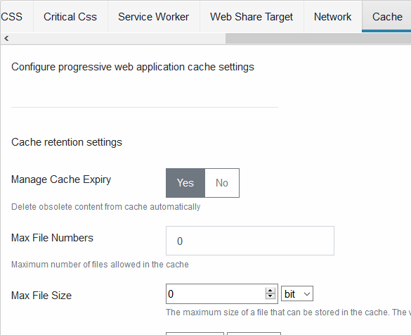

# Cache

Configure the service worker cache settings.

## Manage Cache Expiry

Enable or disable cache management

## Max File Numbers

The maximum number of files allowed in the cache. _0_ means no limit

## Max File Size

The maximum size of a cacheable response

## Default Cache Retention

The maximum lifetime for a cached response

## Image

Cache setting for images

## Javascript

Cache setting for javascript

## CSS

Cache setting for CSS file

## Fonts

Cache setting for fonts

## HTML Documents

Cache setting for HTML documents
