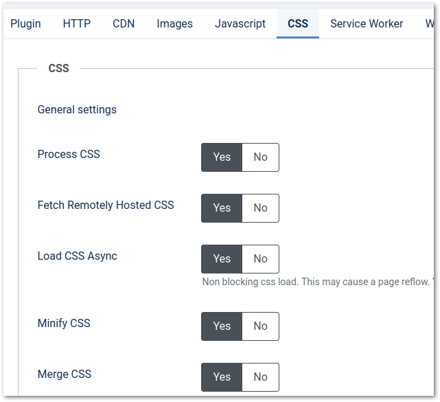

# CSS

Configure CSS settings.

## General Settings

### Process CSS

Enable or disable CSS processing.

### Fetch Remotely Hosted CSS

Fetch CSS files hosted on remote servers.

## CSS Optimization Settings

### Load CSS Async

Asynchronously load css so that page rendering is not blocked while css files are loading. CSS files will be moved at the bottom of the page. We should configure critical css in order to avoid FOUC

### Minify CSS

Enable or disable merging css files together.

### Merge CSS

Enable or disable merging css files into a single file, to reduce the number of HTTP requests.

### Parse Inline CSS Attribute

Parse CSS defined in HTML 'style' attribute.

## Critical CSS path

Critical CSS enables instantaneous page rendering. 
Critical CSS path are generated on the fly only the first time a page is opened and it matches any viewport in the viewport list.
The CSS will be generated only for that viewport.

### Parse Critical Css

Enable or disable critical CSS path optimization.

### Viewports

Specify viewports that will trigger critical CSS path.

## CSS Parser Options

### Parse Import Rule

Enable or disable @import processing.

### Allow Duplicate Rules

Enable or disable duplicate rules. @font-face rules are never merged.

### Allow Duplicate Declarations

Enable or disable duplicate declarations in the same rule.

### Parse Error

Define how CSS parse errors are handled.

## CSS Rendering Options

### CSS Level

The CSS Level specification used to render colors.

### Convert Colors

Convert CSS colors to the format selected. The value NONE means no color conversion will be made.

### Remove Comments

Enable or disable CSS comments removal.

### Remove Empty Rules

Enable or disable empty rules removal.

## Web Fonts Settings

### Preload Web Fonts

Enable or disable web fonts preloading.

### Font Display

Set font-display css property.

## File Matching

### Ignored CSS files

Ignore css files that match the specified pattern.
The pattern can be a part of the plugin URL or the full URL. All files matching at least one pattern will be ignored.

### Removed CSS Files

Remove css files that match the specified pattern.
The pattern can be a part of the plugin URL or the full URL. All files matching at least one pattern will be removed.
