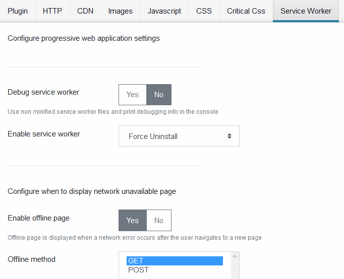

# Service Worker

Configure progressive web application settings. Service worker enable offline capabilities for your web app. The service worker requires two settings:

- You need to provide an [app icon](#apps-icons-directory) at [least 192x192px and 512x512px icons](https://developers.google.com/web/fundamentals/app-install-banners/#criteria)
- You need to enable the [web manifest generation](#build-manifest-file)



## General Settings

### Enable Service Worker

Configure the service worker. Values are

- Enabled: Enable the service worker
- Disabled: This will not deactivate the service worker if it is already running in the browser. The service worker initialization script will not be included in the pages.
- Force Uninstall: Actively remove the service worker from the browser

### Debug Service Worker

Enable or disable debug mode in the service worker.

- Yes: Use unminified files from the service worker. Also log messages in the browser console
- No: Use minified files from the service worker. Only error messages are logged into the browser console

### Cache URLs

The list of urls available offline. These urls will be cached when the service worker is installed, making them available offline

```text
/
/blog
/contact
```

### Do Not Cache URLs

Provide a list of urls that will never be cached by the service worker

```text
/login
```

## Offline Page Settings

The offline page is shown whenever the browser cannot load the page. Offline page appearance can be customized with the settings below.

### Enable Offline Page

Enable or disable offline page support.

### Offline Method

Configure which requests methods are intercepted by the service worker. You can configure the service worker to intercept GET, POST or ANY method. it will return the offline page whenever a request fails.

### Preferred Offline Page

Load the offline page from an url you provide or from the HTML code specified [below](#offline-html-page)

- URL: use 'Offline Page URL' setting
- HTML: use 'Offline HTML Page' setting

### Offline Page URL

Specify the URL from which the offline page will be loaded

### Offline HTML Page

Provide HTML content of the offline page

## Manifest File Settings

These settings control the service worker manifest file

### Build Manifest File

Enable or disable the manifest file. The manifest file is used to configure the progressive app settings. For more information about the manifest settings go to this [mdn page](https://developer.mozilla.org/en-US/docs/Web/Manifest)

### App Short Name

Provide the app short name

### App Name

Provide the app name

### App Description

Provide app description

### Start URL

Provide the URL of the start page of your progressive web application once it is installed

### Background Color

Provide the background color

### Theme Color

Provide the app theme color

### Display Mode

Configure the app display mode

### Apps Icons Directory

Select the directory that contains your app icons. The directory must be located under the /images folder of your Joomla website.
Supported formats are ICO JPG PNG and WEBP

### Apps Icons Purpose

The app icon purpose. see [MDN](https://developer.mozilla.org/en-US/docs/Web/Manifest/icons#Values)

### Apps Screenshots

The app screenshots folder. see [MDN](https://developer.mozilla.org/en-US/docs/Web/Manifest/screenshots)

### Prefer Native Apps

Indicate whether native apps should be preferred over this app

### Android App Store Url

App store url of the androïd app associated with this web pp

### IOS App Store Url

App store url of the IOS app associated with this web app
